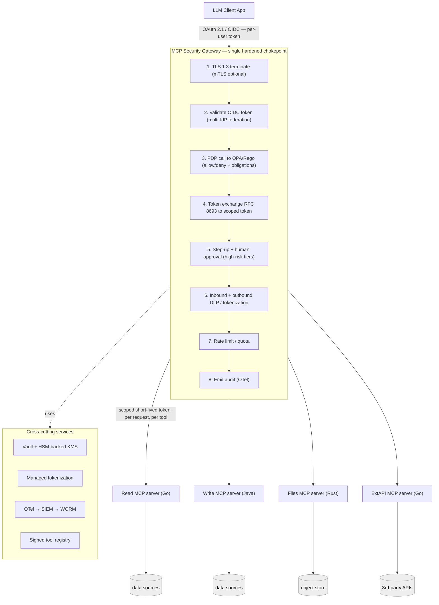

# Secure, Language-Agnostic MCP Service — Architecture & Security Design

> **Status:** Draft v1.8 · **Date:** 2026-05-31
> **Context:** MCP (Model Context Protocol) service for a corporate, highly regulated environment.
> Security is the primary design driver.

---

## Table of Contents

1. [Scope & Decisions](#1-scope--decisions)
2. [Assumptions & Non-Goals](#2-assumptions--non-goals)
3. [Threat Model (MCP-specific)](#3-threat-model-mcp-specific)
4. [Reference Architecture](#4-reference-architecture)
5. [Identity & Authorization](#5-identity--authorization)
6. [Data Protection](#6-data-protection)
7. [High-Risk Tool Gating (Step-up + Human Approval)](#7-high-risk-tool-gating-step-up--human-approval)
8. [Supply Chain & Tool Governance](#8-supply-chain--tool-governance)
9. [Runtime Isolation & Egress](#9-runtime-isolation--egress)
10. [Audit & Observability](#10-audit--observability)
11. [Secrets & Key Management](#11-secrets--key-management)
12. [Data Residency (Multi-Region)](#12-data-residency-multi-region-eu--brazil--us)
13. [Compliance Control Mapping](#13-compliance-control-mapping-summary)
14. [Governance & Control Ownership](#14-governance--control-ownership)
15. [Policy, Configuration & Change Governance](#15-policy-configuration--change-governance)
16. [Gateway Security & Failure Modes](#16-gateway-security--failure-modes)
17. [Privacy, Data Lifecycle & Model Boundary](#17-privacy-data-lifecycle--model-boundary)
18. [Third-Party, Vendor & Model Provider Risk](#18-third-party-vendor--model-provider-risk)
19. [Corporate Access Governance](#19-corporate-access-governance)
20. [Incident Response & Breach Notification](#20-incident-response--breach-notification)
21. [Business Continuity & Disaster Recovery](#21-business-continuity--disaster-recovery)
22. [Continuous Monitoring & Compliance Evidence](#22-continuous-monitoring--compliance-evidence)
23. [Secure SDLC & Control Testing](#23-secure-sdlc--control-testing)
24. [Data Classification Scheme](#24-data-classification-scheme)
25. [MCP Primitive & Capability Governance](#25-mcp-primitive--capability-governance)
26. [AI Governance (EU AI Act · NIST AI RMF · ISO 42001)](#26-ai-governance-eu-ai-act--nist-ai-rmf--isoiec-42001)
27. [Delivery Phasing](#27-delivery-phasing)
28. [Open Items / Next Decisions](#28-open-items--next-decisions)
- [Appendix A — Glossary](#appendix-a--glossary)
- [Appendix B — Standards & References](#appendix-b--standards--references)

---

## 1. Scope & Decisions

These are the confirmed requirements that drive every decision in this document.

| Dimension | Decision |
|---|---|
| **Compliance regimes** | GDPR, LGPD (Brazil), HIPAA (PHI), PCI-DSS, SOC2 |
| **Governance overlays** | EU AI Act, NIST AI RMF, ISO/IEC 42001, and FedRAMP Moderate alignment are treated as governance/assurance overlays, not declared compliance regimes for v1 (§26). |
| **Capabilities exposed** | Read-only queries · Write/mutating actions · File/document access · External tool/API calls |
| **MCP primitives** | Tools governed; resources/prompts classified & scanned; **sampling & elicitation off by default**; roots path-scoped (§25) |
| **Data classification** | 4-tier (Public/Internal/Confidential/Restricted) + overlay tags PHI/PCI/PII/special-category (§24) |
| **Transport** | Remote HTTP (Streamable HTTP / SSE) |
| **Identity model** | Per-user OAuth 2.1 / OIDC (OpenID Connect) with SSO (single sign-on); **sender-constrained tokens** — DPoP baseline, mTLS-bound for service-to-service (§5) |
| **Platform** | Containerized, orchestrator-agnostic |
| **Enforcement topology** | Central security gateway (single chokepoint) |
| **Identity provider** | **Vendor-agnostic via OIDC / OAuth 2.1 standards.** Any OIDC-compliant IdP is pluggable behind the standard (e.g. Keycloak, Entra, Okta, Ping, Auth0); multiple issuers federated simultaneously. Named products are interchangeable examples, not dependencies. |
| **Policy engine** | OPA (Open Policy Agent) / Rego — acts as the PDP (Policy Decision Point) |
| **High-risk tool gating** | Step-up auth (MFA, multi-factor authentication) **+** human approval |
| **Tokenization / vault** | Buy — managed tokenization service |
| **Audit sinks** | **Vendor-agnostic via OTLP / OpenTelemetry standards.** OTel (OpenTelemetry) pipeline → swappable, OTLP-capable backends (e.g. Grafana, Elastic Cloud, Amazon CloudWatch, Splunk/Sentinel) → WORM (Write Once Read Many) immutable store as the audit-of-record. Named products are interchangeable examples, not dependencies. |
| **Server languages** | Go, Java/Spring AI, Rust (security lives outside the server, so any are fine) |
| **Data residency** | Multi-region: EU, Brazil, US (region-pinned per data subject) |
| **Secrets / keys** | HashiCorp Vault (secrets, dynamic creds) **+** HSM (Hardware Security Module)-backed KMS (Key Management Service) |
| **Audit retention** | **Recommended:** 7 years default; see §10 |
| **Egress** | **Recommended:** strict egress allowlist; see §9 |

### Core architectural principle

> **Primary security controls do not live inside the MCP servers.** They live in a hardened enforcement layer that every server sits behind. The servers (Go/Java/Rust) implement business logic and a small mandatory safety contract only: validate scoped gateway-issued identity, honor policy obligations, constrain data returned, preserve idempotency, and avoid unsafe logging. Centralizing enforcement keeps controls language-agnostic while preventing server implementations from becoming blind trust zones.

---

## 2. Assumptions & Non-Goals

### Assumptions
- A corporate identity provider (IdP) — or several — already exists and can issue OIDC tokens carrying group/role and data-residency claims.
- A managed tokenization/vault service and an HSM-backed KMS are procurable in every target region (EU, Brazil, US).
- Container orchestration (Kubernetes or equivalent) with network-policy support is available.
- Clients are MCP-compliant and authenticate **per-user** — no anonymous or shared-account access.
- A SIEM and object-lock (WORM) storage are available for audit retention.
- Human approvers exist and are reachable in-band to satisfy the approval gate (§7).

### Non-Goals
- **Not** a public/internet-facing service — access is restricted to authenticated corporate users.
- **Not** a multi-tenant SaaS for external customers (single organization, multi-region).
- Does **not** train or fine-tune models on regulated data.
- Does **not** define the LLM client/agent itself — only the MCP service it calls.
- Does **not** cover physical data-center controls (assumed inherited from the hosting platform's compliance posture).
- Sidecar / service-mesh enforcement is **out of scope for v1** (central gateway chosen); recorded as a future option (§28).
- **Formal FedRAMP ATO is not pursued in v1.** FedRAMP Moderate is an alignment target only; authorization-boundary work, 3PAO assessment, and an Authority to Operate are future scope.

---

## 3. Threat Model (MCP-specific)

MCP introduces attack surface beyond ordinary REST services. The design must defend each of these explicitly.

| # | Threat | Vector | Primary control(s) |
|---|---|---|---|
| T1 | **Prompt / tool-poisoning injection** | Malicious instructions embedded in tool *output* or tool *descriptions* steer the model toward dangerous calls | Treat all tool output as untrusted; outbound DLP (Data Loss Prevention) scan; signed/pinned tool manifests; never auto-execute high-risk tools (§7) |
| T2 | **Confused deputy** | Server uses its own broad credential to act for a user lacking rights | Per-user **token exchange (RFC 8693)**; servers hold no god-credential for user data (§5) |
| T3 | **Token passthrough** | Client's upstream token blindly forwarded downstream | Gateway terminates and re-mints scoped, audience-bound tokens; passthrough forbidden (§5) |
| T4 | **Excessive agency** | Write/delete/external call invoked without genuine intent | Step-up auth + human approval on all high-risk tiers (§7) |
| T5 | **Tool shadowing / rug-pull** | A tool's schema/behavior changes after approval | Signed, version-pinned tool registry; behavior change forces re-approval (§8) |
| T6 | **Data exfiltration via tool args** | Model sends PHI/PAN to an external-call tool | Egress allowlist + outbound DLP + tokenization at boundary (§6, §9) |
| T7 | **Over-collection** | Tool returns more than the task requires | Minimum-necessary: field projection, mandatory row caps, redaction (§6) |
| T8 | **Supply-chain compromise** | Malicious dependency or image | SBOM (Software Bill of Materials), signed images, admission control, CVE scanning in CI (§8) |
| T9 | **Credential / key theft** | Static secrets leaked from a server | Dynamic short-lived creds from Vault; HSM-held keys never leave the boundary (§11) |
| T10 | **Audit tampering** | Attacker edits/deletes logs to hide activity | Hash-chained, append-only WORM storage; SIEM forwarding (§10) |

---

## 4. Reference Architecture



**Text fallback (same diagram):**

```
                         OAuth 2.1 / OIDC (per-user token)
   ┌──────────┐                        │
   │  Client  │ ───────────────────────┼──────────────────────────┐
   │ (LLM app)│                         ▼                          │
   └──────────┘             ┌───────────────────────────────────┐ │
                            │       MCP SECURITY GATEWAY        │ │
                            │  (single hardened chokepoint)     │ │
                            │                                   │ │
                            │  1. TLS 1.3 terminate (mTLS opt.) │ │
                            │  2. Validate OIDC token (multi-   │ │
                            │     IdP federation)               │ │
                            │  3. PDP call → OPA/Rego (allow/   │ │
                            │     deny + obligations)           │ │
                            │  4. Token exchange (RFC 8693) →   │ │
                            │     scoped downstream token       │ │
                            │  5. Step-up + human approval for  │ │
                            │     high-risk tiers               │ │
                            │  6. Inbound + outbound DLP /      │ │
                            │     tokenization                  │ │
                            │  7. Rate limit / quota            │ │
                            │  8. Emit audit (OTel)             │ │
                            └──────────────┬────────────────────┘ │
              scoped short-lived token, per request, per tool      │
        ┌──────────────┬──────────────────┼──────────────┬────────┘
        ▼              ▼                   ▼              ▼
   ┌─────────┐   ┌─────────┐        ┌─────────┐    ┌─────────┐
   │ Read    │   │ Write   │        │ Files   │    │ ExtAPI  │
   │ MCP svr │   │ MCP svr │        │ MCP svr │    │ MCP svr │
   │ (Go)    │   │ (Java)  │        │ (Rust)  │    │ (Go)    │
   └────┬────┘   └────┬────┘        └────┬────┘    └────┬────┘
        ▼             ▼                  ▼              ▼
   data sources  data sources      object store   3rd-party APIs
        │             │                  │              │
        └─────────────┴──────────────────┴──────────────┘
                 (reachable ONLY via gateway —
                  network policy / zero direct ingress)

   Cross-cutting:
   • Vault (dynamic creds, transit) + HSM-backed KMS (key custody)
   • Managed tokenization service (PAN/PHI/PII surrogates)
   • OTel collector → SIEM → WORM immutable audit store
   • Signed tool registry (version-pinned manifests)
```

**Key invariant:** MCP servers accept connections **only** from the gateway. Enforced by network policy / mesh authz, so a compromised or misbehaving server cannot be reached directly and cannot bypass the controls.

### Minimum MCP server security contract

Central gateway enforcement does not mean servers are security-free. Every MCP server must implement the following local contract before production use:

| Requirement | Acceptance test |
|---|---|
| Accept only gateway-issued, audience-bound downstream tokens | Direct client token, wrong audience, expired token, and missing token are rejected |
| Enforce gateway obligations that affect the query/result shape | Row caps, field projections, redaction, and tokenization obligations are applied before response |
| Preserve idempotency for mutating actions | Same idempotency key and context cannot execute the action twice; changed context is rejected |
| Constrain data access to the requested resource and purpose | Attempts to widen filters, access unrequested fields, or query another subject fail closed |
| Emit structured audit metadata without raw regulated payloads | Logs contain request ids, hashes, tool/version, and decision ids; no PAN/PHI/PII/secrets |
| Fail closed on missing classification or policy context | Unknown or unlabeled data defaults to Restricted and is blocked unless explicitly granted |

---

## 5. Identity & Authorization

### Authentication

**Mandate: identity providers are pluggable behind open OIDC / OAuth 2.1 standards — no vendor lock-in.** The gateway is an OAuth **Resource Server**; the **Authorization Server** is any OIDC-compliant IdP. The gateway depends on the *standard* — not on any vendor's proprietary APIs, SDKs, or token format — so an IdP can be added, swapped, or federated without code changes (the same agnostic principle applied to identity as to telemetry in §10).

**Requirements (normative):**
- Trust is configured **per issuer**, discovered via **OIDC Discovery** (`/.well-known/openid-configuration`) with keys from the published **JWKS** endpoint (key rotation handled automatically). No hard-coded vendor endpoints.
- Tokens are validated against **standard OIDC/JWT claims** (`iss`, `aud`, `exp`, `nbf`, `sub`, `scope`, plus mapped `roles`/`groups`). No reliance on vendor-proprietary claim shapes; vendor-specific claims are normalized into the canonical PDP input (§5 *Authorization*) at the edge.
- **Multiple issuers are federated simultaneously** via an **issuer allowlist**. Either pattern is valid and interchangeable: (a) a broker IdP fronts the others, or (b) the gateway validates each trusted issuer directly — both are standard OIDC.
- **PKCE** (RFC 7636) mandatory; **Resource Indicators** (RFC 8707) bind each token to a specific MCP server audience; short token TTLs.
- **Sender-constrained tokens (proof-of-possession), not plain bearer:** **DPoP** (RFC 9449) is the baseline so a stolen token cannot be replayed; **mTLS-bound tokens** (RFC 8705) for the highest-risk service-to-service paths. Defeats token theft/replay (hardens T3).
- Named products (Keycloak, Entra ID, Okta, Ping, Auth0, …) are **interchangeable examples**, not commitments. Onboarding or replacing an IdP is a configuration change (issuer + claim mapping), governed by §15.

### Transport, session & replay protection
Streamable HTTP / SSE is long-lived and stateful, so the session and write-path get explicit controls:
- **Session binding:** every MCP session ID is bound to the authenticated identity (and DPoP/mTLS key); a session cannot be used by a different principal. IDs are high-entropy, rotated, and expire with the token.
- **Hijack/fixation defense:** reject server-supplied or client-fixated session IDs; detect and alert on identity/key mismatch mid-stream; tear down the stream on anomaly.
- **Mid-stream integrity:** messages are authenticated to the bound session; out-of-band or replayed frames are dropped.
- **Idempotency on mutating tools:** every write / delete / external-call invocation carries a client **idempotency key**; the gateway+server deduplicate so a retry (or replayed approval) cannot execute the action twice. This is distinct from the single-use *approval* id (§15) — it protects the *execution*.

### Authorization (no confused deputy)
- **Externalized PDP — OPA / Rego.** Gateway calls OPA on every tool invocation.
- Policy input: `{ user, roles, groups, tool, tool_version, resource, data_classification, purpose, region, time }` — `data_classification` follows the scheme in §24.
- Policy output: `allow | pending_approval | deny` plus obligations (e.g. "redact field X", "cap rows at N", "require step-up", "tokenize PAN").
- **Deny-by-default.** No matching allow rule → denied.
- **Token exchange (RFC 8693):** gateway swaps the user token for a downstream token scoped to *that user + that tool + that resource*. Servers never hold a broad standing credential for user data → defeats T2/T3.

### Policy structure (Rego sketch)
```rego
package mcp.authz

default decision := {"effect": "deny", "obligations": []}

# Read tier: allowed if role grants the resource and purpose is valid.
decision := {"effect": "allow", "obligations": obligations} {
    input.tool.tier == "read"
    role_grants[input.user.role][input.tool.resource]
    valid_purpose[input.purpose]
}

# High-risk tier, first pass: authorization is plausible but execution must pause.
decision := {"effect": "pending_approval", "obligations": approval_obligations} {
    input.tool.tier in {"write", "external", "bulk", "file-write"}
    role_grants[input.user.role][input.tool.resource]
    valid_purpose[input.purpose]
    not valid_bound_approval
}

# High-risk tier, execution pass: allow only after the exact request is approved.
decision := {"effect": "allow", "obligations": obligations} {
    input.tool.tier in {"write", "external", "bulk", "file-write"}
    role_grants[input.user.role][input.tool.resource]
    valid_purpose[input.purpose]
    valid_bound_approval
}

valid_bound_approval {
    input.approval.step_up_verified == true
    input.approval.human_approved == true
    input.approval.bound_context_hash == input.request.context_hash
    input.approval.single_use == true
    input.approval.not_expired == true
}

approval_obligations := ["require_step_up", "require_human_approval"]

obligations[o] {
    input.data_classification == "PCI"
    o := {"action": "tokenize", "field": "pan"}
}
obligations[o] {
    input.tool.tier == "bulk"
    o := {"action": "cap_rows", "limit": 1000}
}
```

---

## 6. Data Protection

| Layer | Control |
|---|---|
| **In transit** | TLS 1.3 everywhere; mTLS (mutual TLS) gateway↔server↔datastore |
| **At rest** | Envelope encryption; data keys wrapped by HSM-backed KMS; per-tenant/per-region keys; documented rotation |
| **PAN / PHI / PII** | (Primary Account Number / Protected Health Information / Personally Identifiable Information) **Managed tokenization service** at the boundary — the model receives surrogate tokens, not raw values, unless policy + purpose strictly require detokenization. Shrinks PCI scope dramatically. |
| **Outbound DLP** | Scan every tool *result* and every external-call *argument*; block/redact card numbers, SSN/CPF, MRN. This is the backstop against exfiltration via prompt injection (T6). |
| **Minimum-necessary** | Field-level projection, mandatory row caps, purpose-binding enforced via OPA obligations (T7) |
| **GDPR / LGPD** | Region-pinned processing (§12); purpose limitation carried as a request attribute; DSAR (Data Subject Access Request)/erasure path; **avoid caching raw personal data** so there are no undeleteable copies |
| **Logs** | Redaction filters on all logs; never log raw regulated payloads (logs are themselves PII) |

Data classes referenced here (PAN/PHI/PII/special-category and the sensitivity levels) are defined in §24.

### PCI-DSS scope & CDE boundary
- **Strategy: minimize the Cardholder Data Environment (CDE).** Raw PAN is **tokenized at the boundary** (managed service), so MCP servers, the model context, logs, and audit store handle **surrogate tokens only** — never raw PAN.
- This keeps the CDE small: only the tokenization service (and any explicitly-approved detokenization path) is in scope; MCP servers and the gateway aim to be **out of CDE scope** by never touching cardholder data.
- Document the boundary with a **segmentation diagram** and a **PCI responsibility matrix** with the tokenization vendor (§18). Target the lightest applicable **SAQ** rather than a full RoC where the assessor agrees scope is reduced.
- Detokenization is a Restricted-class action: deny-by-default, step-up + human approval (§7), and fully audited (§10).

---

## 7. High-Risk Tool Gating (Step-up + Human Approval)

Every tool carries a **risk tier** in its manifest. The gateway enforces the matching gate:

| Tier | Examples | Gate |
|---|---|---|
| **read** | single-record query | PDP allow only (auto) |
| **bulk** | large/aggregate read, export | PDP + **step-up auth (MFA)** + **human approval** |
| **write** | create / update / delete | PDP + **step-up auth (MFA)** + **human approval** |
| **external** | call to 3rd-party / internal API | PDP + **step-up auth (MFA)** + **human approval** + egress allowlist |
| **file-write** | write/modify documents | PDP + **step-up auth (MFA)** + **human approval** |

**Flow:** gateway receives a high-risk call → PDP returns `pending_approval` with `require_step_up` and `require_human_approval` obligations → gateway pauses the call, triggers MFA re-auth, and routes an approval request to the designated approver with the bound request context (who, tool version, action, args hash/summary, resource, data classes, region, purpose, expiry). After step-up and approval, the gateway replays the exact request context to the PDP. The PDP returns `allow` only when the approval is valid, unexpired, single-use, and bound to the same context hash; otherwise the request remains pending or is denied. Every state transition is audited.

> Rationale: the strongest gate was chosen deliberately given the combined HIPAA + PCI envelope and FedRAMP-aligned control target. It directly mitigates T4 (excessive agency) and limits the blast radius of prompt-injection-induced tool calls (T1).

---

## 8. Supply Chain & Tool Governance

- **Signed, version-pinned tool registry.** Each manifest (name, JSON schema, description, risk tier) is signed. Gateway rejects unsigned or version-drifted tools → defeats T5 (rug-pull/shadowing).
- **Behavior/schema change ⇒ new version ⇒ re-approval** before it is callable.
- **CI security gates:** dependency CVE scan, SAST, secret scanning, license check. Pin to known-good GA versions (note: local Maven mirror is flaky on newest artifacts — prefer pinned GA).
- **Image supply chain:** SBOM (Software Bill of Materials; SPDX/CycloneDX format) per image, signed images (cosign/Sigstore), admission control rejects unsigned → defeats T8.

---

## 9. Runtime Isolation & Egress

- Each MCP server: own container, **non-root, read-only root FS, no host network, seccomp + AppArmor/SELinux**, minimal base image.
- **Network policy:** servers accept ingress **only** from the gateway; zero direct external reachability.
- **Egress — recommendation: strict egress allowlist.**
  - Default deny outbound; allow only named, approved destinations.
  - The **external-call server** is the highest-risk exfiltration channel (T6) — its allowlist is the tightest, paired with outbound DLP.
  - Full air-gap is stronger but impractical given the external-call capability is in scope; strict allowlist + DLP + egress logging is the right balance. Revisit air-gap for any subsystem that does not need outbound access.
- **Rate limits & quotas** per user and per server at the gateway — caps blast radius and cost.

---

## 10. Audit & Observability

- **Pipeline:** structured audit events → **OpenTelemetry (OTel) collector** (vendor-neutral collection, redaction, tail-sampling, fan-out) → **multiple backends in parallel**: observability/analytics (Grafana, Elastic Cloud, CloudWatch), **SIEM** (Security Information and Event Management; Splunk/Sentinel) for detection/alerting, and a **WORM immutable store** (object-lock, hash-chained, append-only) as the tamper-evident audit-of-record. Defeats T10.
- **Every tool call records:** federated identity, tool + version, args hash, PDP decision + policy id, approvals (step-up + approver), data classes touched, result size, region, timestamp.
- **Alerting:** volume spikes, denied-then-retried patterns, off-hours bulk reads, detokenization events, egress to newly-allowed destinations.
- **One log satisfies many regimes:** HIPAA access logging, SOC2 CC-series, PCI Req. 10 — design it once, deliberately.

### Audit integrity (trusted time + anchoring)
A hash-chain is only as trustworthy as its timestamps and its independence from the writer. Therefore:
- **Trusted time:** all components use authenticated/secure time sync (e.g. authenticated NTP / NTS); event ordering does not rely on a single mutable clock.
- **External anchoring:** the WORM hash-chain is periodically anchored with an **RFC 3161 trusted timestamp** (or written to an independent, separately-administered store) so neither an audit admin nor a platform admin can rewrite history undetected.
- **Verification:** hash-chain + anchor verification is a routine evidence task (§22), not just an incident-time activity.

### Audit & observability backends (vendor-agnostic via OTel standards)

**Mandate: backends are pluggable behind open OpenTelemetry standards — no vendor lock-in.** MCP servers and the gateway emit telemetry using the **OpenTelemetry SDK and OTLP (OpenTelemetry Protocol) only**, following OTel **semantic conventions**. The **Collector** is the single contract point; any backend that ingests OTLP — natively or via a Collector exporter — can be added or swapped **without changing a single line in the servers or gateway**. This is the same principle that makes the service language-agnostic, applied to telemetry.

**Requirements (normative):**
- Instrument **exclusively** with the OTel SDK + OTLP export. **No vendor-proprietary agents or SDKs** embedded in the servers/gateway.
- A backend is **eligible only if** it accepts OTLP directly or through a Collector **exporter**. Proprietary-only ingestion paths are disqualified.
- All routing, redaction, sampling, and fan-out live in the **Collector pipeline as config-as-code** — never in the servers.
- Audit attributes use OTel **semantic conventions** (plus a documented audit-attribute schema) so events are portable across backends.
- The named products below are **interchangeable examples**, not commitments. Selection, addition, or replacement of a backend is a **Collector-config change**, governed by §15.

Roles are fixed; the products fulfilling each role are swappable:

| Role | Eligibility | Example backends (swappable) | Notes / caveats |
|---|---|---|---|
| **Collection / processing** | — (the standard itself) | OpenTelemetry Collector | Single OTLP contract point; redaction/tokenization processors run here **before** any payload reaches a backend |
| **Dashboards / metrics / traces** | OTLP-native or exporter | Grafana (Loki/Tempo/Mimir), Grafana Cloud | Not an immutable audit store. SaaS → DPA + region pinning |
| **Log search / forensics** | OTLP via exporter | Elastic Cloud (Elasticsearch/Kibana), OpenSearch | Index ILM + region; SaaS → DPA/BAA + residency (§12, §18) |
| **Cloud-native logs / alarms** | OTLP via exporter | Amazon CloudWatch, Azure Monitor, GCP Cloud Logging | Region-scoped; export to immutable object storage for retained copies |
| **Security detection / SIEM** | OTLP via exporter | Splunk, Microsoft Sentinel | Correlation/alert rules + IR workflows live here |
| **Audit-of-record (WORM)** | OTLP via exporter → object lock | S3 Object Lock, Azure Immutable Blob, GCS Bucket Lock | Hash-chained, append-only — the compliance source of truth |

- **Role separation is a compliance requirement, not a preference.** Observability/search backends hold **derived operational copies**. The **WORM store remains the immutable audit-of-record** (T10) — never let a dashboard or search backend become the only copy of an audit event.
- **Regulated-data caveat:** every externally-hosted backend is a **data processor** — requires a DPA/BAA, residency pinning per §12, and **must receive hashes + metadata only, never raw regulated payloads** (enforced by the Collector redaction processor). Add each to the §18 vendor inventory and the §22 evidence matrix.
- **Portability / exit:** because everything is OTLP, adding, swapping, or leaving a backend (incl. a SaaS vendor) is a Collector-config change — directly satisfying the vendor **exit-plan** requirement in §18. No re-instrumentation, no server redeploy.

### Retention — recommendation
Take the **maximum across regimes**:

| Regime | Driver | Min retention |
|---|---|---|
| SOC2 | audit baseline | ~1 year |
| PCI-DSS | Req. 10.7 | 1 year (3 mo. hot) |
| HIPAA | §164.316 | 6 years |
| SOX / financial | if applicable | 7 years |

**Plan for 7 years default**, with security-incident records kept up to 10 years. Tier storage: hot (90 days, fast query) → warm → cold WORM (remainder).

---

## 11. Secrets & Key Management

- **HashiCorp Vault:** dynamic, short-lived database/API credentials (no static secrets in servers → mitigates T9); transit encryption; per-server policies; leasing + revocation.
- **HSM-backed KMS (FIPS 140-2/3 validated):** custody of root/wrapping keys for envelope encryption and tokenization; keys never leave the HSM boundary. Required posture for PCI key custody and FedRAMP-aligned assurance.
- Per-region key hierarchies to support residency (below).

---

## 12. Data Residency (Multi-Region: EU · Brazil · US)

- **Region-pinned deployment.** Data subject's region determines where their data is processed and stored:
  - EU personal data → EU region (GDPR)
  - Brazilian personal data → Brazil region (LGPD)
  - US / PHI → US region (HIPAA)
- **Per-region:** isolated datastores, region-local KMS key hierarchy, region-local WORM audit store.
- **Control plane** (gateway config, policy bundles, tool registry) may be centrally managed but carries **no regulated data**.
- **Routing:** gateway selects the regional backend from the data subject or source-record residency attribute. The authenticated user's residency claim / tenant is only a default when the requested data has no stronger subject/source residency marker.
- **Mixed-region requests:** requests spanning multiple residency regions are split into region-local subrequests where policy allows. If splitting is not possible, the request is denied by default unless a documented legal basis and approved transfer safeguard exist.
- **Administrative/support access:** support users are routed to the data region of the affected subject or record, not the administrator's home region. Break-glass cross-region access requires explicit policy, approval, and enhanced audit.
- **Aggregates and analytics:** cross-region aggregate outputs are allowed only when de-identified or anonymized to the approved threshold and when re-identification risk is reviewed by privacy/data governance.

---

## 13. Compliance Control Mapping (summary)

| Control in this design | GDPR/LGPD | HIPAA | PCI-DSS | SOC2 |
|---|---|---|---|---|
| Per-user OIDC + token exchange | ✓ (accountability) | ✓ (access ctrl) | ✓ (Req. 7,8) | ✓ (CC6) |
| OPA deny-by-default + obligations | ✓ (purpose limit) | ✓ (min necessary) | ✓ (Req. 7) | ✓ (CC6) |
| Tokenization at boundary | ✓ (minimization) | ✓ | ✓ (scope reduction) | ✓ |
| Outbound DLP + egress allowlist | ✓ | ✓ | ✓ (Req. 1) | ✓ (CC6.6/7) |
| Step-up + human approval | — | ✓ (safeguards) | ✓ | ✓ (CC6) |
| Hash-chained WORM audit + SIEM | ✓ (Art. 30) | ✓ (§164.312(b)) | ✓ (Req. 10) | ✓ (CC7) |
| Vault + HSM KMS | ✓ (Art. 32) | ✓ (encryption) | ✓ (Req. 3) | ✓ (CC6) |
| Region-pinned residency | ✓ (Ch. V / LGPD) | ✓ | — | ✓ |
| SBOM + signed images | — | ✓ | ✓ (Req. 6) | ✓ (CC8) |
| Sender-constrained tokens (DPoP/mTLS) | ✓ (Art. 32) | ✓ (access ctrl) | ✓ (Req. 8) | ✓ (CC6) |
| Data classification scheme (§24) | ✓ (Art. 5/9) | ✓ (min necessary) | ✓ (scope) | ✓ (CC3/CC6) |
| MCP primitive governance (§25) | ✓ | ✓ | ✓ | ✓ (CC6) |
| Audit trusted-time + anchoring | ✓ (Art. 30) | ✓ (§164.312(b)) | ✓ (Req. 10) | ✓ (CC7) |

AI-specific governance (EU AI Act, NIST AI RMF, ISO/IEC 42001) and FedRAMP Moderate alignment overlay these same controls but are not declared v1 compliance regimes in frontmatter — see §26.

---


## 14. Governance & Control Ownership

Technical controls are not sufficient for corporate compliance unless each control has a named owner, review cadence, and evidence source. The architecture therefore requires an operating model around the gateway, policies, tools, data, audit, and vendors.

| Control area | Primary owner | Required governance |
|---|---|---|
| Gateway enforcement / PEP | Platform security | Hardened build, admin access review, configuration approval, bypass testing |
| OPA/Rego policy / PDP | Security architecture + data owners | Policy change approval, test evidence, signed bundles, rollback plan |
| Tool registry and risk tiers | MCP platform owner + security | New-tool review, version approval, manifest signing, behavior-change re-approval |
| Data classification and purpose mapping | Data governance / privacy | Data inventory, legal basis, purpose catalog, residency rules |
| Tokenization / detokenization | Security + data owners | Detokenization approvals, PCI scope evidence, access review |
| SIEM / alert handling | SOC / SecOps | Alert triage runbooks, review evidence, escalation timelines |
| Vault / KMS / HSM | Security engineering | Key custody, rotation, emergency revocation, access review |
| Human approval gate | Business owner + compliance | Approver independence, approval review, abuse monitoring |
| Vendor assurance | Third-party risk management | Due diligence, contracts, DPA/BAA, subprocessor review |
| Incident response | Security incident commander | Containment, notification, evidence preservation, post-incident review |

### Required corporate artifacts
- RACI matrix for every control family.
- System security plan / control narrative.
- Data flow diagrams showing regulated data boundaries.
- Risk register with accepted residual risks.
- Exception register with owners and expiry dates.
- Evidence calendar for recurring control operation.

---

## 15. Policy, Configuration & Change Governance

OPA policy, gateway configuration, tool manifests, and egress allowlists are security-sensitive production assets. A mistaken policy can create the same impact as a vulnerable service.

### Policy lifecycle
- Policies are versioned, reviewed, tested, and approved before deployment.
- Policy bundles are signed; the gateway rejects unsigned or stale bundles.
- Policy changes require separation of duties: author, reviewer, and deployer should not all be the same person for high-risk rules.
- Every policy decision emitted to audit includes policy bundle version, rule id, input hash, decision, and obligations.
- Emergency rollback is tested and documented.
- Deny-by-default behavior is covered by automated tests.

### Configuration lifecycle
- Gateway routes, IdP trust configuration, JWKS issuers, egress allowlists, DLP rules, tokenization settings, and risk-tier mappings follow change control.
- Configuration is stored as code where feasible, signed, peer reviewed, and deployed through CI/CD.
- Production changes generate immutable audit events.
- Emergency changes require after-the-fact review within a defined SLA.

### Approval binding
Human approval must be bound to the exact request context:

- User identity and session.
- Tool name and signed version.
- Arguments hash and human-readable summary.
- Resource id, data class, region, and purpose.
- Requested action and risk tier.
- Expiry time and single-use approval id.

If any bound attribute changes, the approval is invalid and must be repeated. Requesters cannot approve their own actions.

---

## 16. Gateway Security & Failure Modes

The gateway is the enforcement chokepoint and therefore a critical security boundary. It must be designed as highly available, hardened infrastructure with explicit fail behavior.

### Hardening requirements
- Separate administrative plane from data plane.
- Privileged admin access requires MFA, device posture where available, just-in-time elevation, and full session audit.
- Gateway images are signed and admitted only through policy-controlled deployment.
- Runtime runs as non-root with minimal privileges, read-only root filesystem, seccomp/AppArmor/SELinux, and no host networking.
- Gateway plugins/filters must be signed, version-pinned, and reviewed as security-critical code.
- Direct server access bypassing the gateway is continuously tested and alerted.

### Fail-closed behavior
| Dependency failure | Default behavior |
|---|---|
| OPA/PDP unavailable | Deny tool invocation except documented break-glass flow |
| Token exchange unavailable | Deny downstream call |
| DLP unavailable | Block regulated-data responses and external-call arguments |
| Tokenization unavailable | Block PAN/PHI/PII release; do not fall back to raw data |
| Approval service unavailable | Block high-risk tools |
| Vault/KMS unavailable | Deny operations requiring new credentials/keys; existing leases expire normally |
| SIEM unavailable | Buffer signed audit events locally/regionally; alert on backlog; do not silently drop logs |
| WORM store unavailable | Continue short-term buffered collection only within approved retention window |

### Degraded-mode limits and recovery targets

These targets are default acceptance criteria for v1. A project may tighten them, but relaxing them requires a risk exception with owner and expiry.

| Dependency | Maximum degraded window | Recovery target | Required operator action |
|---|---|---|---|
| OPA/PDP | 0 minutes for tool execution | Restore or roll back policy bundle within 30 minutes | Block calls; notify platform security |
| Token exchange | 0 minutes for downstream calls | Restore within 30 minutes | Block calls; rotate affected downstream credentials if replay risk exists |
| DLP | 0 minutes for regulated responses/external arguments | Restore within 60 minutes | Block regulated flows; allow Public/Internal reads only if policy permits |
| Tokenization | 0 minutes for PAN/PHI/PII release | Restore within 60 minutes | Block detokenization and regulated output; do not emit raw values |
| Approval service | 0 minutes for high-risk tools | Restore within 4 hours | Block high-risk tools; no auto-approval fallback |
| Vault/KMS | Existing leases only until expiry | Restore within lease TTL or 60 minutes, whichever is shorter | Stop issuing new credentials/keys; prepare credential rotation |
| SIEM | 4 hours with signed regional buffering | Restore export and replay backlog within 24 hours | Alert on backlog; preserve local signed buffer |
| WORM store | 24 hours with signed regional buffering | Flush backlog within 24 hours after restore | Freeze nonessential high-risk workflows if buffer approaches limit |

### Availability and abuse resistance
- Rate limits are enforced before expensive processing where possible.
- Quotas apply per user, per tool, per region, and per data class.
- Circuit breakers protect downstream systems.
- Bulk reads and repeated small reads are correlated to detect reconstruction attempts.
- Gateway capacity, latency, denial rate, DLP backlog, and audit backlog are monitored.

---

## 17. Privacy, Data Lifecycle & Model Boundary

The service must document not only where data is stored, but how personal and regulated data moves through prompts, tool calls, model context, logs, files, and audit systems.

### Privacy operations
- Maintain Records of Processing Activities (ROPA) for GDPR/LGPD, including purposes, data categories, data subjects, recipients, processors, retention, transfer safeguards, and security measures.
- Define legal basis and purpose codes used by OPA policies.
- Trigger DPIA/PIA review for new high-risk processing, new data classes, new regions, new model providers, or new external recipients.
- Maintain DSAR and erasure workflows, including documented exceptions for immutable security audit logs.
- Maintain retention schedules for business data, prompts, tool inputs, tool outputs, temporary files, approval records, DLP findings, token mappings, and audit metadata.

### Model/inference boundary
- Regulated data may enter the LLM prompt/context only after minimization, redaction, and tokenization obligations have been applied. Raw Restricted data (PHI, PCI, special-category data, secrets, credentials, and direct identifiers) is prohibited in model context unless a documented exception is approved by legal/compliance, data owner, and security.
- Region-pinned regulated data uses region-local inference and region-local prompt/session storage. Cross-region inference is denied by default and requires explicit legal basis, transfer safeguard, vendor approval, and enhanced audit.
- Model providers must contractually prohibit training, fine-tuning, or product improvement on prompts, tool outputs, files, embeddings, metadata, or regulated data from this service.
- Prompt/response retention at model providers is disabled by default. If a provider requires transient abuse-monitoring retention, the retention period, region, data classes, and access controls must be recorded in the vendor inventory and approved before use.
- OAuth tokens, downstream tokens, secrets, raw credentials, private keys, and approval tokens must never be exposed to model context, tool output, prompts, traces, or logs.
- Tool output is always rendered as untrusted data, not instructions. Clients must use a structured envelope that separates data, citations, tool metadata, and agent instructions; injected instructions inside tool output are ignored by policy.
- Model prompts and outputs are subject to the retention baseline below and to the same DLP/tokenization rules as tool arguments/results.

### Retention baseline
| Data type | Baseline requirement |
|---|---|
| Raw regulated payloads | Avoid caching; retain only when legally/business-required |
| Prompt/session context | Minimize; redact/tokenize; enforce region and retention controls |
| Tool arguments/results | Store hashes and metadata by default; raw values only by exception |
| Approval records | Retain for audit period with sensitive fields redacted/tokenized |
| DLP findings | Retain enough to evidence control operation without storing unnecessary payload |
| Token mappings | Retain according to tokenization vendor controls and legal/business need |
| Audit logs | 7-year default unless legal/compliance approves another retention schedule |

---

## 18. Third-Party, Vendor & Model Provider Risk

The architecture relies on external providers for identity, tokenization, SIEM, WORM storage, KMS/HSM, cloud infrastructure, and potentially model inference. These dependencies require corporate third-party risk management.

### Required vendor controls
- Security due diligence before onboarding and annually thereafter.
- SOC 2 Type II, ISO 27001, PCI, HIPAA, FedRAMP, or equivalent reports where applicable.
- Data Processing Agreement (DPA) for personal data and Business Associate Agreement (BAA) for PHI where required.
- PCI responsibility matrix for any provider touching cardholder data or tokenization controls.
- Subprocessor inventory, notification process, and region/data residency commitments.
- Contractual no-training/no-retention terms for model providers handling regulated data.
- Breach notification SLAs aligned to corporate legal obligations.
- Exit plan covering data return, deletion, key destruction, and evidence of deletion.

### External APIs
- External destinations are approved by data class and purpose, not only hostname.
- Each destination has an allowed schema defining what fields/classes may leave.
- TLS validation is mandatory; mTLS is preferred for internal or partner APIs.
- DNS rebinding and destination drift are mitigated through controlled DNS, certificate validation, and egress policy enforcement.
- External-call responses are DLP-scanned before returning to the model/client.

---

## 19. Corporate Access Governance

Per-user authentication is necessary but not sufficient. Corporate compliance requires recurring proof that access remains appropriate.

- Joiner/mover/leaver process integrated with the IdP.
- Quarterly access reviews for users with regulated-data access.
- More frequent privileged-access reviews for gateway admins, policy admins, Vault/KMS admins, SIEM admins, and approvers.
- Dormant account detection and automatic suspension.
- Just-in-time privileged access for production administration.
- Break-glass accounts are minimized, vaulted, monitored, and reviewed after every use.
- Service accounts/workload identities are inventoried, least-privileged, rotated, and reviewed.
- Approver rosters are reviewed periodically for independence and business need.

---

## 20. Incident Response & Breach Notification

A regulated MCP service needs explicit incident response procedures tied to the architecture's control points.

### Response playbooks
- Suspected prompt/tool-poisoning attack.
- Unauthorized data access or over-collection.
- External-call exfiltration attempt.
- Compromised MCP server container.
- Compromised gateway or policy bundle.
- Token/key exposure.
- DLP bypass or tokenization failure.
- Audit pipeline outage or tampering suspicion.
- Vendor/model-provider incident.

### Containment actions
- Disable a tool version globally or regionally.
- Revoke user sessions and downstream exchanged tokens.
- Rotate Vault leases, API credentials, and KMS data keys where applicable.
- Revert to a known-good policy bundle.
- Tighten egress allowlists or disable external-call server.
- Preserve signed audit evidence and relevant runtime artifacts.

### Notification and post-incident requirements
- Maintain regime-specific notification timelines and decision criteria for GDPR, LGPD, HIPAA, PCI-DSS, SOC2 customer commitments, and FedRAMP where applicable.
- Legal/compliance determines whether an event is reportable; security provides evidence and impact assessment.
- Post-incident review documents root cause, affected data/classes, control failures, remediation, and residual risk.
- Tabletop exercises are performed at least annually and after major architecture changes.

---

## 21. Business Continuity & Disaster Recovery

Confidentiality controls must be balanced with availability and recoverability. For GDPR Article 32 and corporate resilience, the service must be able to restore access to personal data in a timely manner after incidents.

- Define RTO/RPO per capability: read, write, file, external-call, audit, policy, tokenization, Vault/KMS, approval service.
- Backups are encrypted with region-local keys and tested through restore exercises.
- Disaster recovery preserves data residency; failover must not move regulated data to an unauthorized region.
- WORM audit recovery is tested for both query and integrity verification.
- Vault/KMS/HSM recovery procedures are documented and tested.
- OPA policy bundles and signed tool manifests are recoverable from trusted, versioned sources.
- Degraded-mode behavior is documented; high-risk tools remain blocked if approval, DLP, tokenization, or policy enforcement is unavailable.

---

## 22. Continuous Monitoring & Compliance Evidence

The design must continuously prove that controls are operating. SIEM events are one input, but compliance also requires repeatable evidence.

### Monitoring program
- Vulnerability scanning for images, dependencies, hosts/nodes, and exposed endpoints.
- Patch SLAs by severity and exploitability.
- Runtime detection for suspicious process, network, filesystem, and privilege activity.
- Configuration drift detection for gateway, network policy, OPA bundles, tool manifests, egress rules, and IdP trust.
- Monthly review of SIEM alerts, denied calls, detokenization events, bulk reads, egress changes, and approval patterns.
- Periodic penetration tests focused on gateway bypass, MCP prompt/tool injection, policy bypass, egress exfiltration, and audit tampering.

### Evidence matrix
| Control | Evidence | Frequency |
|---|---|---|
| OPA deny-by-default | Policy tests, signed bundle metadata, deployment approval | Every policy change |
| Gateway-only access | Network-policy tests, denied direct-ingress attempts | Continuous + quarterly review |
| Tool registry signing | Manifest signature verification logs | Every deployment |
| Human approval | Approval records with request hash and approver id | Every high-risk action |
| DLP/tokenization | DLP scan logs, tokenization metrics, exception review | Continuous + monthly review |
| Access reviews | Completed access certification exports | Quarterly |
| Key management | Rotation logs, HSM/KMS access logs | Per rotation + quarterly review |
| Audit immutability | WORM lock evidence, hash-chain verification | Monthly / quarterly |
| Vulnerability management | Scan results, remediation tickets, exception approvals | Continuous + monthly review |
| Incident response | Tabletop records, incident tickets, post-incident reports | Annual + per incident |
| AI risk classification | Use-case risk determination, review record, approved mitigations | Per use case + annual review |
| Human oversight | Approval records, override/denial metrics, approver roster review | Every high-risk action + quarterly review |
| Transparency notice | User-facing AI notice, processing disclosure, policy/version evidence | Every material UX or policy change |
| Model boundary | Provider no-training/no-retention attestation, region evidence, DLP test results | Onboarding + quarterly review |

---

## 23. Secure SDLC & Control Testing

Every new MCP server, tool, policy, or gateway extension must pass security review before production use.

### SDLC gates
- Security requirements captured during design.
- Threat model updated for each new tool category or data class.
- Code review required for business logic, gateway filters, policies, and manifests.
- SAST, SCA, secret scanning, license scanning, and container scanning in CI.
- DAST/API tests for exposed gateway behavior.
- Policy tests validate allow, deny, obligation, and fail-closed cases.
- MCP-specific adversarial tests cover tool poisoning, malicious tool descriptions, argument exfiltration, excessive agency, and output over-collection.
- Release approval requires SBOM, provenance, signed image, signed manifest, and rollback plan.

### Production readiness checklist
- Data classification and purpose mapping complete.
- Tool risk tier approved.
- Egress destination approved, if applicable.
- DLP/tokenization behavior tested.
- Audit fields verified.
- Access model reviewed.
- Region routing validated.
- Failure behavior tested for OPA, DLP, tokenization, Vault/KMS, approval, and audit pipeline dependencies.

### QA control acceptance matrix

These are minimum release-blocking tests for the reference design. Project-specific ADRs may add controls, but must not remove these without a risk exception.

| Control ID | Control | Required positive test | Required negative / abuse test | Evidence artifact | Owner | Frequency |
|---|---|---|---|---|---|---|
| QA-01 | Gateway-only access | Valid gateway call reaches server | Direct client-to-server call is blocked and alerted | Network-policy test output, alert id | Platform security | Continuous + quarterly |
| QA-02 | OIDC token validation | Valid issuer/audience/sender-constrained token accepted | Wrong issuer, audience, expired token, bearer replay, and DPoP key mismatch rejected | Auth test report, gateway logs | Identity/platform security | Every auth config change |
| QA-03 | OPA deny-by-default | Explicit allow rule succeeds | Missing rule, stale bundle, unsigned bundle, and malformed input deny | Policy unit tests, bundle signature | Security architecture | Every policy change |
| QA-04 | Approval binding | Approved high-risk request executes once | Changed args/resource/context, expired approval, self-approval, and replay are rejected | Approval record, PDP decision log | Business owner + compliance | Every high-risk flow change |
| QA-05 | DLP/tokenization | PAN/PHI/PII is tokenized/redacted per obligation | Raw regulated data in tool result or external-call argument is blocked | DLP test corpus result, tokenization metrics | Data security | Every DLP rule change |
| QA-06 | Data minimization | Field projection and row caps are enforced | Over-broad query and repeated small-read reconstruction patterns are blocked or alerted | API test output, SIEM alert | Data governance | Every tool release |
| QA-07 | Residency routing | Region-marked records route to local backend | Mixed-region or cross-region access without legal basis is denied | Routing test report, audit event | Privacy + platform | Every routing change |
| QA-08 | Audit integrity | Event appears in SIEM and WORM with hash-chain verification | Attempted log deletion/tamper is detected | WORM lock proof, hash verification report | SecOps | Monthly / quarterly |
| QA-09 | Model boundary | Redacted/tokenized prompt reaches approved region-local model provider | Raw Restricted data, secrets, tokens, or unapproved region/provider is blocked | Prompt DLP test, provider attestation | AI governance + privacy | Provider onboarding + quarterly |
| QA-10 | Server safety contract | Server honors scoped token, obligations, and idempotency | Wrong token audience, ignored row cap, duplicate idempotency key, and missing classification fail closed | Server contract test suite | MCP platform owner | Every server release |
| QA-11 | Supply chain | SBOM, provenance, signed image, pinned dependencies pass admission | Mutable image/action tag, unsigned image, critical untriaged CVE, or missing SBOM blocks release | CI/admission logs, SBOM | AppSec | Every build/release |
| QA-12 | Degraded mode | Dependency outage follows documented fallback | OPA/DLP/tokenization/approval outage cannot silently allow regulated or high-risk flows | Chaos/failure test report | Platform security | Quarterly + major changes |

---

## 24. Data Classification Scheme

`data_classification` is the attribute that OPA authz (§5), DLP/tokenization (§6), residency (§12), and retention (§17) all key on. It is defined here as a **two-dimensional scheme**: a sensitivity *level* plus orthogonal regulatory *overlay tags*.

### Sensitivity levels
| Level | Definition | Default handling |
|---|---|---|
| **Public** | Approved for public release | No special controls |
| **Internal** | Non-public business data; low harm if exposed | Authn required; standard logging |
| **Confidential** | Sensitive business/personal data; material harm | Least-privilege, encryption, DLP, minimization |
| **Restricted** | Highest sensitivity; severe legal/financial/safety harm | Restricted access + step-up + human approval, tokenization, strict residency, enhanced audit |

### Regulatory overlay tags
Applied *in addition to* a level; a record may carry several:
- **PII** — personal data (GDPR/LGPD).
- **special-category** — GDPR Art. 9 / LGPD sensitive data (health, biometrics, etc.) → handled as **Restricted**.
- **PHI** — protected health information (HIPAA) → handled as **Restricted**.
- **PCI** — cardholder data (PAN, etc.) → **Restricted + mandatory tokenization**; drives CDE scope (§6).

### How classification drives controls
| Class | OPA effect | DLP / tokenization | Residency | Approval |
|---|---|---|---|---|
| Public / Internal | allow per role | none / standard | any approved region | none |
| Confidential | allow + obligations | redact / minimize | region-pin if PII | step-up for bulk |
| Restricted (or PHI/PCI/special) | deny-by-default unless explicit grant | tokenize / redact mandatory | strict region-pin | step-up + human approval |

- Classification is assigned **at the data source** and carried as a request attribute. **Unknown/unlabelled data defaults to Restricted** (fail-safe).
- This is the **canonical internal model**; align it to the corporate taxonomy where one exists (open item §28).

---

## 25. MCP Primitive & Capability Governance

MCP exposes more than tools. Each primitive is a distinct trust surface and is governed explicitly. **Default posture: deny / disable; enable per-primitive, per-server, by policy** — and every primitive flows through the same gateway chokepoint, authz (§5), classification (§24), DLP (§6), and audit (§10) as tools. None bypass enforcement.

| Primitive | Direction | Key risk | Control |
|---|---|---|---|
| **Tools** | client → server action | excessive agency, injection | Risk-tiered gating (§7); signed manifests (§8) |
| **Resources** | server → model data | untrusted data + possible injected instructions | Treated like tool output: classified (§24), DLP-scanned, authz'd; never trusted as instructions |
| **Prompts** | server → client templates | templated instructions steer the model | Signed/versioned like tools (§8); reviewed for injection; classified |
| **Sampling** | server → client's model | server drives the LLM — confused-deputy / amplification | **Off by default.** Per-server enable only; each request policy-checked, rate-limited, audited; never exposes other users' context |
| **Elicitation** | server → user prompt | phishing / social engineering of the user | **Off by default.** Allow-listed schemas only; rendered as clearly server-originated; never solicits credentials/secrets |
| **Roots** | client → server FS/URI scope | path traversal / over-broad exposure | Scoped to the Files server's approved paths; no host or cross-tenant roots |

- A new primitive or capability for a server = **threat-model update + security review (§23)** before enablement.
- Sampling and elicitation, if ever enabled, inherit the **step-up + human-approval** treatment (§7) because both can act on the user's behalf.

---

## 26. AI Governance (EU AI Act · NIST AI RMF · ISO/IEC 42001)

Because this is an **agentic AI system** processing regulated data for EU/Brazil/US users, AI-specific governance applies alongside the data-protection regimes. These are **governance overlays** — they organize and evidence the technical controls already specified, not new runtime controls.

### EU AI Act
- **Risk classification:** document the system's tier (limited- vs high-risk depends on use case and data); record the determination and revisit per use case.
- **Human oversight:** the step-up + human-approval gate (§7) and deny-by-default authz (§5) are the oversight controls — a human can intervene/override and high-risk actions are never fully autonomous.
- **Transparency:** inform users they are interacting with an AI agent and disclose automated processing (ties to GDPR Art. 13/14 and Art. 22 automated-decision rules).
- **Traceability:** the audit-of-record (§10) supplies the event trail; maintain technical documentation and post-market monitoring (§22).

### NIST AI RMF
- Map controls to **Govern / Map / Measure / Manage**, reusing §14 (ownership), §3 (threat model), §22 (monitoring), and §20 (incident response) as the four-function evidence base.

### ISO/IEC 42001
- Stand up an **AI Management System (AIMS)** — AI policy, roles, risk treatment, lifecycle controls — paired with ISO 27001. Pursue certification if the corporate program requires it.

---

## 27. Delivery Phasing

1. **Foundation** — Gateway + multi-IdP OIDC + token exchange + OTel audit + one **read-only** server. Prove the single chokepoint.
2. **Policy** — OPA/Rego PDP, tool risk tiers, deny-by-default, obligations.
3. **Data controls** — managed tokenization, inbound/outbound DLP, field-level minimization.
4. **High-risk capabilities** — write / files / external-call servers behind step-up + human approval + egress allowlist.
5. **Compliance hardening** — WORM audit + SIEM alerting, SBOM + image signing + admission control, multi-region residency, DSAR/erasure path; assemble control-mapping evidence per regime.

---

## 28. Open Items / Next Decisions

- [ ] Map the §24 classification scheme to the existing corporate data taxonomy (if one exists).
- [ ] EU AI Act: complete the risk-tier determination per use case; record human-oversight + transparency evidence (§26).
- [ ] Confirm the final DPoP-vs-mTLS split per path (§5).
- [ ] Select the RFC 3161 timestamping / external-anchoring provider for the audit hash-chain (§10).
- [ ] PCI: confirm reduced CDE scope and target SAQ with a QSA; finalize the tokenization responsibility matrix.
- [ ] Confirm 7-year retention (vs. shorter) with legal/compliance.
- [ ] Select tokenization vendor (PCI scope-reduction features, multi-region support).
- [ ] Choose SIEM (Splunk vs. Sentinel) — affects OTel exporter config.
- [ ] Define approver routing for human-approval gate (per-team? per-data-class?).
- [ ] Assign control owners and publish RACI matrix for gateway, policy, audit, data, vendor, and incident-response controls.
- [ ] Define compliance evidence calendar and system of record for control artifacts.
- [ ] Complete third-party risk package for IdP, tokenization, SIEM, observability backends (Grafana Cloud, Elastic Cloud, CloudWatch), WORM storage, KMS/HSM, cloud infrastructure, and model providers.
- [ ] Decide which audit/observability backends are self-hosted vs. SaaS per region, and confirm none receive raw regulated payloads (OTel redaction verified).
- [ ] Decide the federation pattern (broker IdP vs. gateway validating each issuer directly) — both are standard OIDC and interchangeable (§5); pick per ops preference. Define the canonical claim-mapping per issuer.
- [ ] Service-mesh selection if/when moving from central gateway toward sidecar isolation (future).

---

## Appendix A — Glossary

- **PDP** — Policy Decision Point (OPA). **PEP** — Policy Enforcement Point (the gateway).
- **Token exchange ([RFC 8693](https://www.rfc-editor.org/rfc/rfc8693))** — swap one token for another with narrower scope/audience.
- **Resource Indicators ([RFC 8707](https://www.rfc-editor.org/rfc/rfc8707))** — bind an access token to a specific resource server.
- **WORM** — Write Once Read Many (immutable, object-locked storage).
- **DLP** — Data Loss Prevention (content inspection/redaction).
- **SBOM** — Software Bill of Materials.
- **mTLS** — mutual TLS (both peers present certificates).
- **MFA** — multi-factor authentication. **SSO** — single sign-on.
- **HSM** — Hardware Security Module. **KMS** — Key Management Service.
- **OTel** — OpenTelemetry. **SIEM** — Security Information and Event Management.
- **DSAR** — Data Subject Access Request (GDPR/LGPD).
- **PAN / PHI / PII** — Primary Account Number / Protected Health Information / Personally Identifiable Information.
- **Confused deputy** — a privileged component tricked into misusing its authority on behalf of a less-privileged caller.

---

## Appendix B — Standards & References

**Protocol & authorization**
- [Model Context Protocol — specification](https://modelcontextprotocol.io/specification)
- [MCP Authorization specification](https://modelcontextprotocol.io/specification/draft/basic/authorization)
- [OAuth 2.1 (draft)](https://datatracker.ietf.org/doc/html/draft-ietf-oauth-v2-1)
- [OpenID Connect Core 1.0](https://openid.net/specs/openid-connect-core-1_0.html)
- [OpenID Connect Discovery 1.0](https://openid.net/specs/openid-connect-discovery-1_0.html) — the IdP-agnostic contract (`/.well-known/openid-configuration`)
- [RFC 7517 — JSON Web Key Set (JWKS)](https://www.rfc-editor.org/rfc/rfc7517) · [RFC 7519 — JWT](https://www.rfc-editor.org/rfc/rfc7519)
- [RFC 8693 — OAuth 2.0 Token Exchange](https://www.rfc-editor.org/rfc/rfc8693)
- [RFC 8707 — Resource Indicators for OAuth 2.0](https://www.rfc-editor.org/rfc/rfc8707)
- [RFC 7636 — PKCE](https://www.rfc-editor.org/rfc/rfc7636)
- [RFC 9449 — DPoP (sender-constrained tokens)](https://www.rfc-editor.org/rfc/rfc9449) · [RFC 8705 — mTLS-bound tokens](https://www.rfc-editor.org/rfc/rfc8705)
- *Example IdPs (interchangeable, must be OIDC-compliant):* Keycloak, Microsoft Entra ID, Okta, Ping, Auth0

**Policy, supply chain & keys**
- [Open Policy Agent (OPA) / Rego](https://www.openpolicyagent.org/docs/latest/)
- [SLSA — Supply-chain Levels for Software Artifacts](https://slsa.dev/)
- [Sigstore / cosign](https://www.sigstore.dev/)
- [CycloneDX SBOM](https://cyclonedx.org/) · [SPDX](https://spdx.dev/)
- [NIST FIPS 140-3 — cryptographic module validation](https://csrc.nist.gov/pubs/fips/140-3/final)
- [RFC 3161 — Time-Stamp Protocol (audit anchoring)](https://www.rfc-editor.org/rfc/rfc3161) · [RFC 8915 — Network Time Security](https://www.rfc-editor.org/rfc/rfc8915)

**Audit & observability — OTel standards (the contract) + example backends (swappable)**
- [OpenTelemetry](https://opentelemetry.io/docs/) · [OTLP protocol spec](https://opentelemetry.io/docs/specs/otlp/) · [Semantic conventions](https://opentelemetry.io/docs/specs/semconv/) · [Collector — processors (redaction/filter)](https://opentelemetry.io/docs/collector/configuration/)
- *Examples (interchangeable, must speak OTLP):*
- [Grafana](https://grafana.com/docs/) · [Loki](https://grafana.com/docs/loki/latest/) · [Tempo](https://grafana.com/docs/tempo/latest/)
- [Elastic Cloud / Elasticsearch](https://www.elastic.co/guide/index.html) · [OpenSearch](https://opensearch.org/docs/latest/)
- [Amazon CloudWatch](https://docs.aws.amazon.com/cloudwatch/) · [Azure Monitor](https://learn.microsoft.com/azure/azure-monitor/) · [GCP Cloud Logging](https://cloud.google.com/logging/docs)
- [S3 Object Lock (WORM)](https://docs.aws.amazon.com/AmazonS3/latest/userguide/object-lock.html) · [Azure Immutable Blob](https://learn.microsoft.com/azure/storage/blobs/immutable-storage-overview) · [GCS Bucket Lock](https://cloud.google.com/storage/docs/bucket-lock)
- [Splunk](https://docs.splunk.com/) · [Microsoft Sentinel](https://learn.microsoft.com/azure/sentinel/)

**Security & AI governance guidance**
- [OWASP Top 10 for LLM Applications](https://owasp.org/www-project-top-10-for-large-language-model-applications/)
- [NIST SP 800-207 — Zero Trust Architecture](https://csrc.nist.gov/pubs/sp/800/207/final)
- [EU AI Act (Regulation 2024/1689)](https://eur-lex.europa.eu/eli/reg/2024/1689/oj)
- [NIST AI Risk Management Framework (AI RMF 1.0)](https://www.nist.gov/itl/ai-risk-management-framework)
- [ISO/IEC 42001 — AI management systems](https://www.iso.org/standard/81230.html)

**Compliance regimes**
- [GDPR (Regulation 2016/679)](https://eur-lex.europa.eu/eli/reg/2016/679/oj) · [LGPD (Lei 13.709/2018)](https://www.planalto.gov.br/ccivil_03/_ato2015-2018/2018/lei/l13709.htm)
- [HIPAA Security Rule](https://www.hhs.gov/hipaa/for-professionals/security/index.html)
- [PCI-DSS v4.0](https://www.pcisecuritystandards.org/document_library/)
- [SOC 2 (AICPA TSC)](https://www.aicpa-cima.com/topic/audit-assurance/audit-and-assurance-greater-than-soc-2) · [FedRAMP](https://www.fedramp.gov/)
