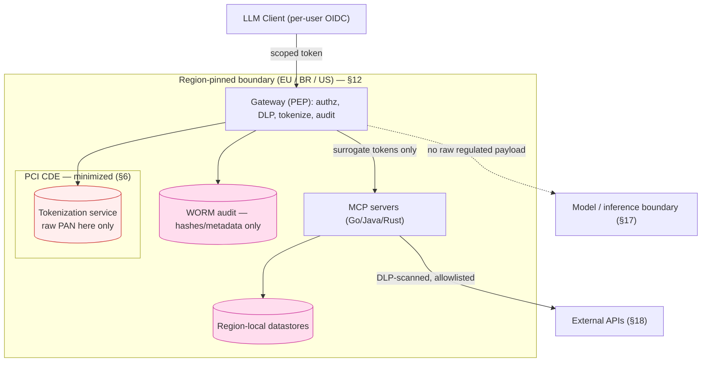

# Data Flow Diagrams — Regulated-Data Boundaries

Required by [ADR-0001 §14 + §17](../adrs/0001-secure-mcp-service-design.md). Shows
where regulated data (PHI/PCI/PII) flows and the trust/compliance boundaries it
crosses — the basis for the PCI CDE scope (§6) and the privacy ROPA (§17).

> Status: **TEMPLATE — starter diagram below; refine per deployment.**

## Primary flow + boundaries

## What each boundary asserts
- **Region boundary (§12):** a data subject's data stays in its region; cross-region
  movement is denied by default and needs explicit policy + legal basis.
- **PCI CDE (§6):** raw PAN exists only in the tokenization service; the gateway,
  servers, model context, logs, and audit store handle **surrogates only**.
- **Model/inference boundary (§17):** no raw regulated payload enters the prompt/
  context; no provider training/retention on regulated data.
- **External egress (§9/§18):** only allowlisted destinations, DLP-scanned, by data
  class and purpose.

## To complete
- One diagram per regulated data type if flows differ (PHI vs PCI vs PII).
- Mark each store with its data classification (§24) and retention (§17).
- Attach the PCI **segmentation diagram** and the SSP authorization boundary.
